:REVEAL_PROPERTIES:
#+REVEAL_ROOT: ./revealjs/
#+REVEAL_THEME: black
#+REVEAL_PLUGINS: (markdown highlight notes zoom)
#+REVEAL_EXTRA_CSS: ./custom_components/custom_style.css
#+REVEAL_EXTRA_SCRIPTS: ./custom_components/custom_script.js
#+REVEAL_SLIDE_FOOTER: LogiQuad: Wie intelligente Systeme die Bestandsführung flexibler machen | M.Eng. Eric Plaß | HTWK Leipzig
#+REVEAL_INIT_OPTIONS: slideNumber:true
#+MACRO: video @@html: <video $1 width=$2 src=$3></video>@@
#+MACRO: r_stack @@html: 
@@
#+MACRO: end_diff  @@html: 
@@
#+REVEAL_HTML: 
:END:
#+TITLE: LogiQuad: Wie intelligente System die Bestandsführung flexibler machen
#+OPTIONS: toc:nil num:nil reveal_global_header:t reveal_global_footer:t reveal_title_slide:nil

* LogiQuad
#+REVEAL_HTML: 

Wie intelligente Systeme die Bestandsführung flexibler machen können
#+REVEAL_HTML: 

#+REVEAL_HTML: 

M.Eng. Eric Plaß, HTWK Leipzig

[[https://fing.htwk-leipzig.de/fakultaet/professuren/prof-martin-guertler][Professur Produktions- und Logistiksysteme]]
#+REVEAL_HTML: 

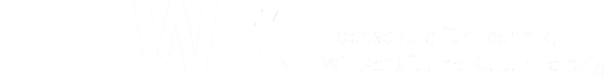

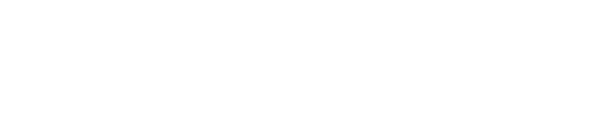

#+REVEAL_HTML: 

#+REVEAL_HTML: 

* Worum geht es?
#+REVEAL_HTML: 

- mobile Robotik
- Inventur
  - Reinforcement Learning
  - Computer Vision
- weitere Probleme und Lösungen
#+REVEAL_HTML: 

* Das Problem: Inventur
#+REVEAL_HTML: 

#+REVEAL_HTML: 

{{{video(data-autoplay loop muted, 100%, ./assets/inv_human.mp4)}}}
#+REVEAL_HTML: 

#+REVEAL_HTML: 

{{{video(data-autoplay loop muted, 100%, ./assets/inv_quad.mp4)}}}
#+REVEAL_HTML: 

#+REVEAL_HTML: 

* Was wäre, wenn...
{{{video(data-autoplay controls muted, 100%, ./assets/inv_quad.mp4)}}}

* Was wäre, wenn...
#+ATTR_HTML: :width 100%
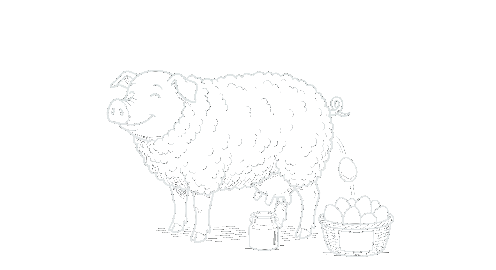

* ...was braucht man dafür?
#+REVEAL_HTML: 

#+REVEAL_HTML: 

Ein mobiler Roboter
- läuft autonom durchs Lager
- erkennt Objekte und deren Lage
- vergleicht mit dem ERP-System
- erstellt automatisch Berichte
#+REVEAL_HTML: 

#+REVEAL_HTML: 

Warum vier Beine statt Räder?
- Treppen und Schwellen
- Enge Gänge und Hindernisse
#+REVEAL_HTML: 

#+REVEAL_HTML: 

* Reinforcement Learning
#+REVEAL_HTML: 

#+REVEAL_HTML: 

#+ATTR_HTML: :width 90% :align center
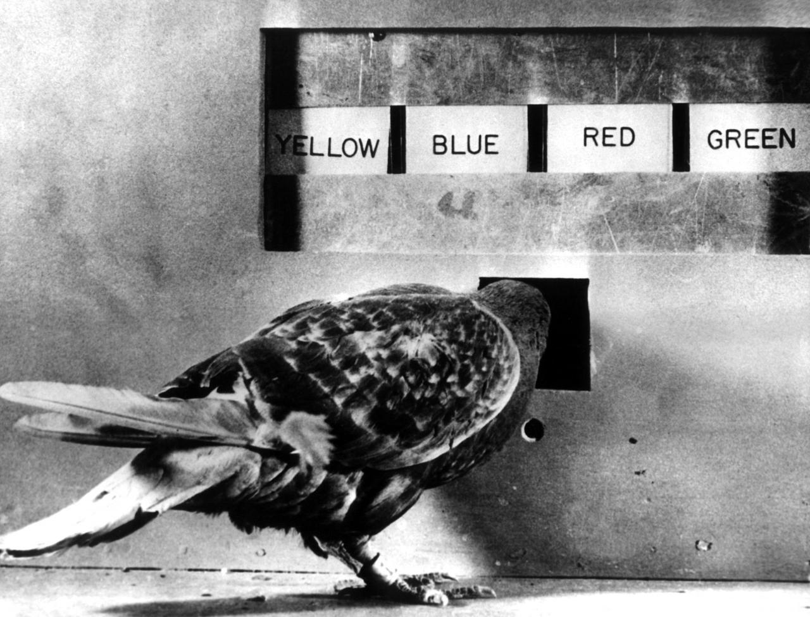
#+REVEAL_HTML: 

[[https://www.deutschlandfunk.de/der-psychologe-burrhus-frederic-skinner-vater-des-100.html][Der Psychologe Burrhus Frederic Skinner, Vater des „programmierten Lernens“, Deutschlandfunk]]
#+REVEAL_HTML: 

#+REVEAL_HTML: 

#+REVEAL_HTML: 

- *operante Konditionierung*
  - "Programmiertes Lernen"
  - "Reinforcement Learning"

- Gute Aktion → Belohnung
- Schlechte Aktion → Strafe
#+REVEAL_HTML: 

#+REVEAL_HTML: 

* Reinforcement Learning
#+name: mdp
#+header: :results file link
#+header: :file assets/mdp.svg
#+BEGIN_SRC latex
  \definecolor{mydark}{RGB}{25,25,25}
  \definecolor{mybright}{RGB}{255,255,255}
  %\definecolor{mybright}{RGB}{25,25,25}
  %\definecolor{mydark}{RGB}{255,255,255}
  \tikzset{
          main/.style={
            draw,
            rounded corners=2pt,
            fill=mydark,
            align=center,
            font=\small,
            inner sep=8pt,
            minimum width=3cm,
            minimum height=1.2cm
          },
          category/.style={
            draw,
            rounded corners=8pt,
            fill=cyan!15,
            align=center,
            font=\small,
            text width=4cm,
            inner sep=4pt
          },
          arrow/.style={
            -{Stealth[length=3mm,width=2mm]},
            thick,
          },
          dashedarrow/.style={
            -{Stealth[length=3mm,width=2mm]},
            dashed,
          }
        }
        \begin{tikzpicture}[invert, node distance=1cm and 1.2cm]
        \node[mybright, main] (agent) {\textbf{Agent}\\Policy, $\pi$};
        \node[mybright, main, below=1cm of agent] (env) {\textbf{Environment}\\Dynamics\\$p(s',r \mid s,a)$};

        \draw [mybright, dashed] (-3.0,-3.25) -- (-3.0,-1.5);
        \draw [mybright,->, >=Stealth] (-1.5,-2) -- (-3.0,-2) node[pos=0.5, fill=mydark]{$S_{t+1}$};
        \draw [mybright,->, >=Stealth] (-1.5,-2.75) -- (-3.0,-2.75) node[pos=0.5, fill=mydark]{$R_{t+1}$};

        \draw [mybright] (-3.0,-2.0) -- (-3.5,-2.0);
        \draw [mybright] (-3.5,-2.0) -- (-3.5,-0.25) node[pos=0.5, fill=mydark] (s) {$S_t$};

        \draw [mybright] (-3.0,-2.75) -- (-4.25,-2.75);
        \draw [mybright] (-4.25,-2.75) -- (-4.25,0.25) node[pos=0.55, fill=mydark] (r) {$R_t$};

        \draw [mybright,->, >=Stealth] (-3.5,-0.25) -- (-1.5,-0.25);
        \draw [mybright,->, >=Stealth] (-4.25,0.25) -- (-1.5,0.25);

        \draw [mybright,->, >=Stealth] (2,-2.5) -- (1.5,-2.5);
        \draw [mybright] (2.0,-2.5) -- (2.0,0.0) node[pos=0.5, fill=mydark] (a) {$A_t$};
        \draw [mybright] (1.5,0.0) -- (2.0,0.0);

        \end{tikzpicture}
#+END_SRC

#+ATTR_HTML: :height 30%, :width 30% :align center
#+RESULTS: mdp
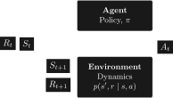

#+REVEAL_HTML: 

mit State $S_t$, Action $A_t$ und Reward $R_t$,

sodass $$S_0, A_0, R_1, S_1, A_1, R_2, S_2, A_2, R_3, ..., R_T$$
#+REVEAL_HTML: 

* Laufen lernen - in der Simulation
#+REVEAL_HTML: 

{{{video(data-autoplay controls loop muted, 100%, ./assets/spot_0.mp4)}}}

{{{video(data-autoplay controls loop muted, 100%, ./assets/spot_1000.mp4)}}}

{{{video(data-autoplay controls loop muted, 100%, ./assets/spot_2000.mp4)}}}
#+REVEAL_HTML: 

#+REVEAL_HTML: 

Start des Trainings

gelerntes Stehen

gelernte Laufstile
#+REVEAL_HTML: 

* Laufen lernen – in der Simulation...
{{{video(data-autoplay controls loop muted, 60%, ./assets/go2_walk_basic_genesis2.mp4)}}}

* ... bis zur komplexen Bewegungssteuerung
{{{video(data-autoplay controls loop muted, 60%, ./assets/go2_walk_ways_zoom2_mobile.mp4)}}}

* Digitaler Zwilling
{{{video(data-autoplay controls loop muted, 100%, ./assets/go2_twin_mobile.mp4)}}}

* Computer Vision
#+REVEAL_HTML: 

#+REVEAL_HTML: 

Was man nicht will

{{{video(data-autoplay controls loop muted, 100%, ./assets/label_handdrawn.mp4)}}}
#+REVEAL_HTML: 

#+REVEAL_HTML: 

Besser wäre
#+ATTR_HTML: :height 100%, :width 100% :align center

#+REVEAL_HTML: 

#+REVEAL_HTML: 

* Daten aus dem Simulator
#+REVEAL_HTML: 

#+ATTR_HTML: :width 100%
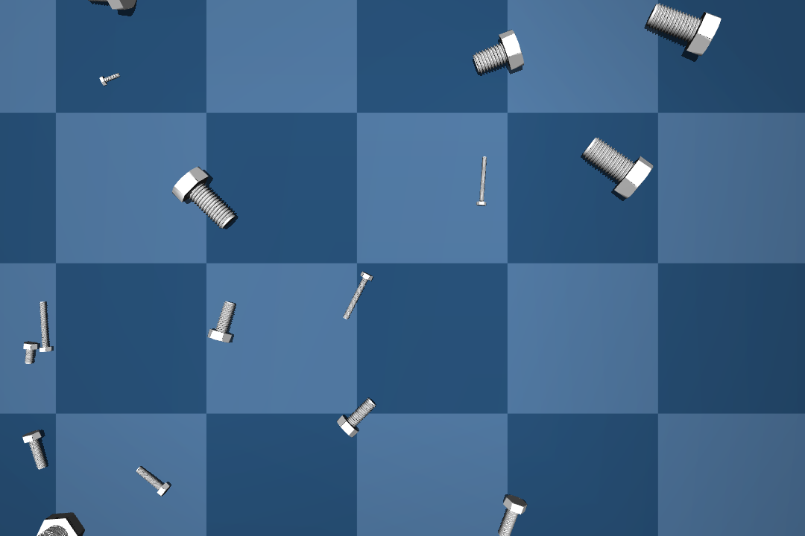

#+ATTR_HTML: :width 100%
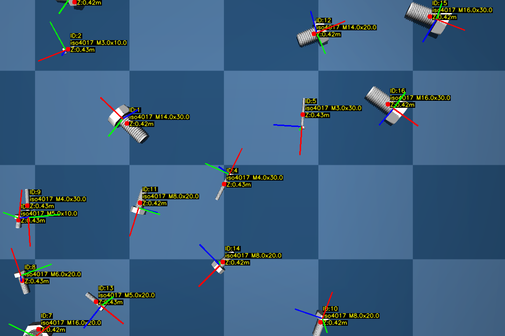
#+REVEAL_HTML: 

#+REVEAL_HTML: 

gerendertes Bild

mit allen Daten die zum Training benötigt werden

#+REVEAL_HTML: 

* Was braucht man dafür
#+REVEAL_HTML: <iframe src="./assets/stl_viewer.html" width="100%" height="600px" style="border: none; border-radius: 8px;"></iframe>

* Daten aus dem Simulator
#+REVEAL_HTML: 

{{{video(data-autoplay controls loop muted, 100%, ./assets/scene_0014.mp4)}}}

{{{video(data-autoplay controls loop muted, 100%, ./assets/scene_0154.mp4)}}}

{{{video(data-autoplay controls loop muted, 100%, ./assets/scene_0002.mp4)}}}
#+REVEAL_HTML: 

#+REVEAL_HTML: 

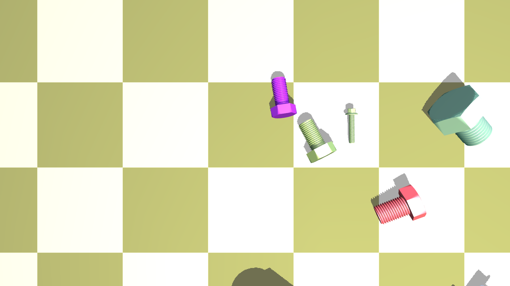

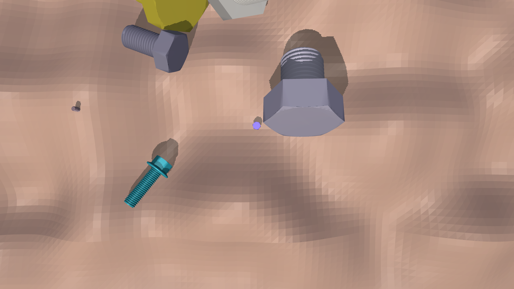

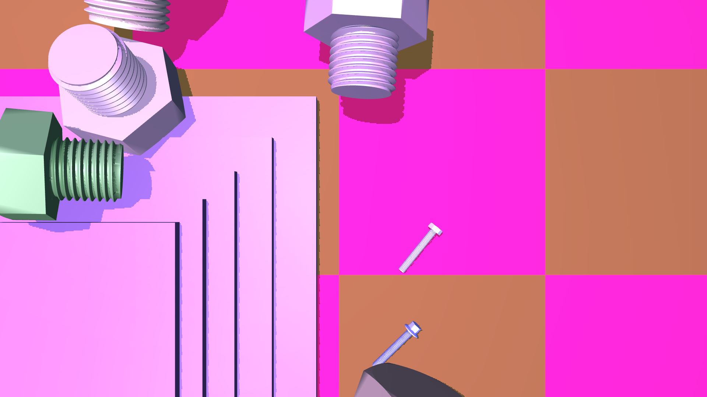
#+REVEAL_HTML: 

* Evaluation der Modelle
#+ATTR_HTML: :width 100%
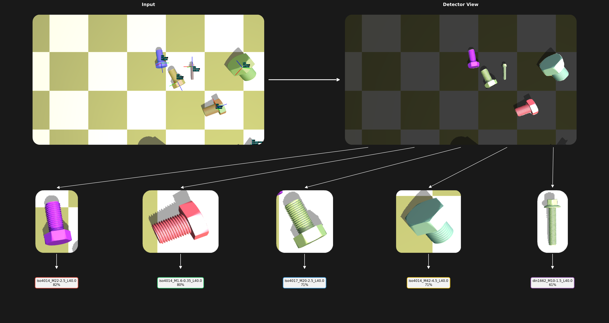

* Übertragung in die Realität
#+ATTR_HTML: :width 100%
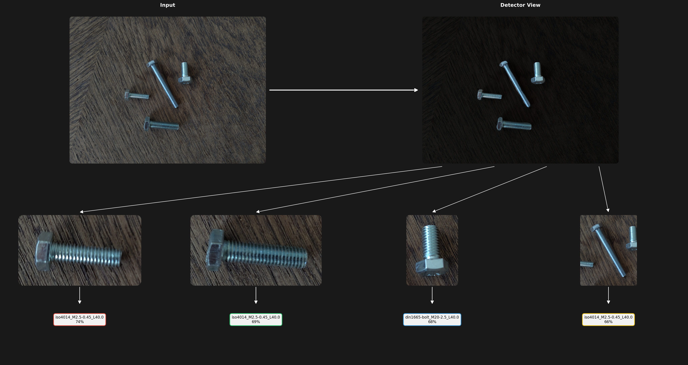

* Übertragung in die Realität
#+ATTR_HTML: :width 100%
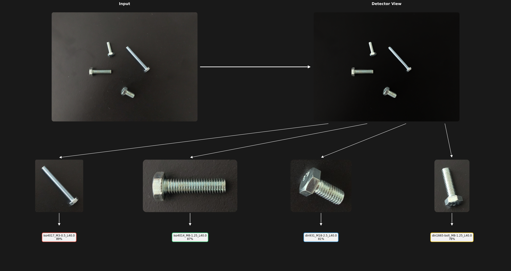

* Übertragung auf andere Bauteile
#+ATTR_HTML: :width 100%
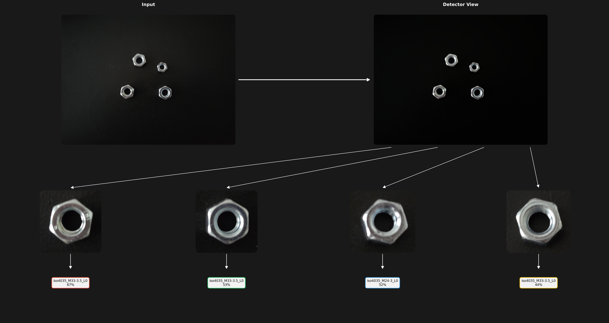

* Der automatisierte Inventurprozess
#+REVEAL_HTML: 

Work in Progress...

#+ATTR_HTML: :height 80%, :width 80% :align center
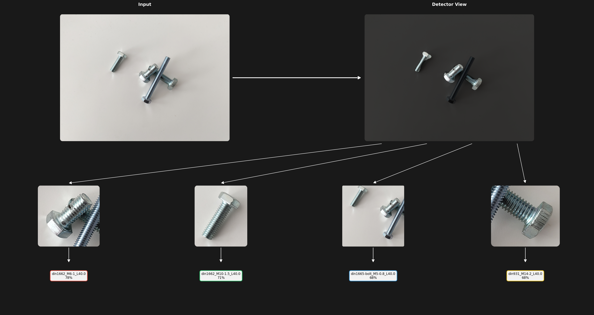
#+REVEAL_HTML: 

* weitere Projekte
:PROPERTIES:
:REVEAL_DATA_TRANSITION: zoom
:END:
#+ATTR_HTML: :height 30%, :width 30% :align center

* Reinforcement Learning Allgemein
:PROPERTIES:
:REVEAL_DATA_TRANSITION: zoom
:END:
#+name: mdp2
#+header: :results file link
#+header: :file assets/mdp2.svg
#+ATTR_REVEAL: :data_id foo1
#+BEGIN_SRC latex
  \definecolor{mydark}{RGB}{25,25,25}
  \definecolor{mybright}{RGB}{255,255,255}
  %\definecolor{mybright}{RGB}{25,25,25}
  %\definecolor{mydark}{RGB}{255,255,255}
  \tikzset{
          main/.style={
            draw,
            rounded corners=2pt,
            fill=mydark,
            align=center,
            font=\small,
            inner sep=8pt,
            minimum width=3cm,
            minimum height=1.2cm
          },
          category/.style={
            draw,
            rounded corners=8pt,
            fill=mydark!85,
            align=center,
            font=\small,
            text width=4cm,
            inner sep=4pt
          },
          arrow/.style={
            -{Stealth[length=3mm,width=2mm]},
            thick,
          },
          dashedarrow/.style={
            -{Stealth[length=3mm,width=2mm]},
            dashed,
          }
        }
        \begin{tikzpicture}[invert, node distance=1cm and 1.2cm]
        \node[mybright, main] (agent) {\textbf{Agent}\\Policy, $\pi$};
        \node[mybright, main, below=1cm of agent] (env) {\textbf{Environment}\\Dynamics\\$p(s',r \mid s,a)$};

        \draw [mybright, dashed] (-3.0,-3.25) -- (-3.0,-1.5);
        \draw [mybright,->, >=Stealth] (-1.5,-2) -- (-3.0,-2) node[pos=0.5, fill=mydark]{$S_{t+1}$};
        \draw [mybright,->, >=Stealth] (-1.5,-2.75) -- (-3.0,-2.75) node[pos=0.5, fill=mydark]{$R_{t+1}$};

        \draw [mybright] (-3.0,-2.0) -- (-3.5,-2.0);
        \draw [mybright] (-3.5,-2.0) -- (-3.5,-0.25) node[pos=0.5, fill=mydark] (s) {$S_t$};

        \draw [mybright] (-3.0,-2.75) -- (-4.25,-2.75);
        \draw [mybright] (-4.25,-2.75) -- (-4.25,0.25) node[pos=0.55, fill=mydark] (r) {$R_t$};

        \draw [mybright,->, >=Stealth] (-3.5,-0.25) -- (-1.5,-0.25);
        \draw [mybright,->, >=Stealth] (-4.25,0.25) -- (-1.5,0.25);

        \draw [mybright,->, >=Stealth] (2,-2.5) -- (1.5,-2.5);
        \draw [mybright] (2.0,-2.5) -- (2.0,0.0) node[pos=0.5, fill=mydark] (a) {$A_t$};
        \draw [mybright] (1.5,0.0) -- (2.0,0.0);

        \node[mybright, category, right=of a, xshift=1cm, yshift=2cm] (tasks) {Task-/Application-specific\\[3pt]
          {\footnotesize Locomotion, Manipulation, Navigation, ...}};
        \draw[mybright, dashedarrow] (agent.north east) to[bend left] (tasks.north);

        \node[mybright, category, below=of env] (sim) {Simulation\\[3pt]
          {\footnotesize Isaac Sim, MuJoCo, Genesis, Kubric}};
        \node[mybright, category, right=of sim, xshift=1.1cm] (real) {Reality\\[3pt]
          {\footnotesize Dreamer, ...}};
        \draw [mybright, <->, >=Stealth, dashed] (sim.east) -- (real.west) node[pos=0.5] (simreal);
        \draw[mybright, dashedarrow] (env.south) -- (sim.north);
        \node[mybright, category, below=of simreal, yshift=-0.5cm] (sim2real) {SIM2REAL\\[3pt]
          {\footnotesize Domain Randomization, Fine-Tuning, RL + Imitation, Meta-RL}};
        \draw[mybright, dashedarrow] (simreal.south) -- (sim2real.north);
        \draw[mybright, dashedarrow] (env.south) -- (real.north);

        \node[mybright, category, above=of agent] (hri) {Human-Robot Interaction\\[3pt]
          {\footnotesize Co-navigation, Collaborative Manipulation, Socially-aware Navigation}};
        \draw[mybright, dashedarrow] (hri.south) -- (agent.north);

        \node[mybright, category, left=of r, xshift=2cm, yshift=-4cm] (benchmark) {Benchmarking\\[3pt]
          {\footnotesize Locomotion, Manipulation, Navigation \\ Metrics, Reproducibility, Comparison}};

        \draw[mybright, dashedarrow] (r.west) to[bend right=20] (benchmark.north);

        \node[mybright, category, left=of r, xshift=2cm, yshift=4cm] (arch) {Policy\\[3pt]
          {\footnotesize MLP, Decision-Transformer, ...}};

        \draw[mybright, dashedarrow] (agent.north west) to[bend left=20] (arch.south);

        \end{tikzpicture}
#+END_SRC

#+ATTR_HTML: :height 80%, :width 80% :align center
#+RESULTS: mdp2
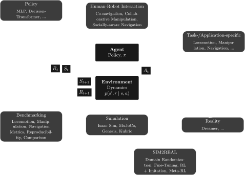

* Vergleich und Entwicklung neuer Regler
#+REVEAL_HTML: 

#+name: lqr
#+BEGIN_SRC python :results silent :exports none
  import math
  import scipy
  import numpy as np
  import pandas as pd
  import random
  import mujoco
  import matplotlib.pyplot as plt
  from matplotlib import cm
  from matplotlib import animation

  # Configure matplotlib for LaTeX rendering and dark theme
  plt.rcParams.update({
      "text.usetex": True,
      "font.family": "Helvetica"
  })
  plt.rc('text', usetex=True)
  plt.rc('font', family='serif')
  plt.style.use('dark_background')
  bg_color = (25/255, 25/255, 25/255)  # RGB in [0,1]

  # Load MuJoCo model and initialize data
  model = mujoco.MjModel.from_xml_path('./custom_components/pendulum/rotary_inverted_pendulum.xml')
  data = mujoco.MjData(model)

  # Reset simulation
  mujoco.mj_resetDataKeyframe(model, data, 0)
  mujoco.mj_forward(model, data)

  # Inverse dynamics calculation at equilibrium
  data.qacc = 0
  mujoco.mj_inverse(model, data)
  qpos0 = data.qpos.copy() # save initial joint positions
  ctrl0 = np.array([0]) # save control input at equilibrium

  # Reset simulation
  nv = model.nv # save number of degrees of freedom
  mujoco.mj_resetData(model, data)

  data.qpos = qpos0 # set position to equilibrium
  mujoco.mj_forward(model, data) # simulate for one step

  # Compute Jacobians
  jac_com = np.zeros((3, nv))
  mujoco.mj_jacSubtreeCom(model, data, jac_com, model.body('base').id) # for CoM of base

  jac_rotpen = np.zeros((3, nv))
  mujoco.mj_jacBodyCom(model, data, jac_rotpen, None, model.body('rotpen').id) # for CoM of rotary's arm

  jac_pend = np.zeros((3, nv))
  mujoco.mj_jacBodyCom(model, data, jac_pend, None, model.body('pendulum').id)  # for CoM of pendulum

  # Define balance cost using Jacobian difference
  jac_diff = jac_com - jac_rotpen # Difference between base and rotary arm Jacobians
  Qbalance = jac_diff.T @ jac_diff # Quadratic cost for balancing

  nu = model.nu # Number of control inputs
  R = np.eye(nu) # Control cost identity matrix

  joint_names = [model.joint(i).name for i in range(model.njnt)]

  # Define state cost matrices
  BALANCE_COST = 1000
  BALANCE_JOINT_COST = 1

  Qjoint = np.eye(nv)
  Qjoint[0, 0] *= BALANCE_COST
  Qjoint[1, 1] *= BALANCE_JOINT_COST

  Qpos = BALANCE_COST * Qbalance + Qjoint # Combine balance and joint costs
  # Full state weighting matrix Q (for [qpos; qvel])
  Q = np.block([[Qpos, np.zeros((nv, nv))], [np.zeros((nv, 2*nv))]])

  # Linearize the system using finite differences
  mujoco.mj_resetData(model, data)
  data.ctrl = ctrl0
  data.qpos = qpos0

  A = np.zeros((2*nv, 2*nv))
  B = np.zeros((2*nv, nu))
  epsilon = 1e-6
  flg_centered = True

  # Linearize around equilibrium (A and B matrices)
  mujoco.mjd_transitionFD(model, data, epsilon, flg_centered, A, B, None, None)

  # Solve the discrete-time Algebraic Riccati Equation for LQR
  P = scipy.linalg.solve_discrete_are(A, B, Q, R)

  # Compute LQR gain matrix K
  K = np.linalg.inv(R + B.T @ P @ B) @ B.T @ P @ A

  dq = np.zeros(model.nv) # Placeholder for derivative of qpos

  # Plot the policy
  detail = 40 # Resolution of the grid

  obs_0 = np.linspace(-math.radians(40), math.radians(40), detail)
  obs_1 = np.linspace(-math.radians(40), math.radians(40), detail)

  pend_vel_values = np.linspace(-5.0, 5.0, 40)   # rad/s
  Z_slices = []

  X, Y = np.meshgrid(obs_0, obs_1)
  Z = np.zeros_like(X)

  for dpq in pend_vel_values:
      Z = np.zeros_like(X)
      for i in range(len(obs_0)):
          for j in range(len(obs_1)):
              data.qpos = qpos0.copy()
              data.qvel[:] = 0.0
              data.qpos[0] = obs_0[i] # Set pendulum angle
              data.qpos[1] = obs_1[j] # Set base angle
              data.qvel[0] = dpq # Set pendulum velocity
              mujoco.mj_differentiatePos(model, dq, 1, qpos0, data.qpos)
              dx = np.hstack((dq, data.qvel)).T
              data.ctrl = ctrl0 - K @ dx # LQR control law
              Z[i][j] = data.ctrl[0] # Store control output for visualization
              Z[i][j] = np.clip(data.ctrl[0], -math.radians(180), math.radians(180)) # Clip data for real system
              # keep in mind that K is computed for an unconstrained linear system
      Z_slices.append(Z)

  fig = plt.figure(facecolor=bg_color)
  ax = fig.add_subplot(111, projection='3d', facecolor=bg_color)

  # ax.plot_surface(X, Y, Z, cmap='viridis')
  surf = [ax.plot_surface(X, Y, Z_slices[0], cmap=cm.viridis)]

  ax.set_xlabel('angle in rad of pendulum')
  ax.set_ylabel('angle in rad of base')
  ax.set_zlabel('action')

  ax.zaxis.labelpad=-0.7

  ax.set_zlim(-math.radians(180), math.radians(180))

  ax.set_title(f'LQR Policy on pendulum velocity = {pend_vel_values[0]:.2f} rad/s')

  plt.tight_layout()

  # Update function for animation
  def update(frame):
      surf[0].remove()
      surf[0] = ax.plot_surface(X, Y, Z_slices[frame], cmap=cm.viridis)
      ax.set_title(f'LQR Policy on pendulum velocity = {pend_vel_values[frame]:.2f} rad/s')
      ax.set_zlim(-math.radians(180), math.radians(180))
      return surf[0],

  # Animate and save as MP4
  anim = animation.FuncAnimation(
      fig, update,
      frames=len(pend_vel_values),
      interval=100,     # ms between frames
      blit=False
  )

  anim.save("./assets/policy_lqr_animation.mp4", writer='ffmpeg', fps=15, dpi=300)
#+END_SRC

{{{video(data-autoplay loop muted, 150%, ./assets/policy_lqr_animation.mp4)}}}

#+name: ppo
#+BEGIN_SRC python :results silent :exports none
    import math
    import scipy
    import numpy as np
    import pandas as pd
    import random
    import mujoco
    import matplotlib.pyplot as plt
    from matplotlib import cm
    from matplotlib import animation
    import gymnasium
    from typing import Dict, Optional, Tuple, Union
    from stable_baselines3 import PPO, A2C

    # Configure matplotlib for LaTeX rendering and dark theme
    plt.rcParams.update({
        "text.usetex": True,
        "font.family": "Helvetica"
    })
    plt.rc('text', usetex=True)
    plt.rc('font', family='serif')
    plt.style.use('dark_background')
    bg_color = (25/255, 25/255, 25/255)  # RGB in [0,1]

    class InvertedPendulum(gymnasium.Env):

        def __init__(self, rew_func="1", ros=False, BALANCE_STD=0.0):
            self.model = mujoco.MjModel.from_xml_path('./custom_components/pendulum/rotary_inverted_pendulum.xml')
            self.sim = mujoco.MjData(self.model)
            self.qpos0 = self.sim.nqpos.copy()
            self.init_qpos = self.sim.qpos.ravel().copy()
            self.init_qvel = self.sim.qvel.ravel().copy()
            self.observation_space = gymnasium.spaces.Box(low=-np.inf, high=np.inf, shape=(4,), dtype=np.float64)
            self._set_action_space()
            self._max_episode_time_sec = 10.0
            self._step = 0
            self.ros = ros
            self.rew_func = rew_func

            self.nu = self.model.nu
            np.random.seed(1)
            self.nsteps = int(np.ceil(self._max_episode_time_sec/self.model.opt.timestep))
            self.perturb = np.random.randn(self.nsteps, self.nu)
            self.CTRL_STD = np.empty(self.nu)
            self.BALANCE_STD = BALANCE_STD
            self.CTRL_RATE = 0.8
            for i in range(self.nu):
                joint = self.model.actuator(i).trnid[0]
                dof = self.model.joint(joint).dofadr[0]
                self.CTRL_STD[i] = self.BALANCE_STD
            width = int(self.nsteps * self.CTRL_RATE/self._max_episode_time_sec)
            kernel = np.exp(-0.5*np.linspace(-3, 3, width)**2)
            kernel /= np.linalg.norm(kernel)
            for i in range(self.nu):
                self.perturb[:, i] = np.convolve(self.perturb[:, i], kernel, mode='same')
            # self.imu = Turtlebot4IMU()

        def _set_action_space(self):
            bounds = self.model.actuator_ctrlrange.copy().astype(np.float32)
            low, high = bounds.T
            self.action_space = gymnasium.spaces.Box(low=low, high=high, dtype=np.float32)
            return self.action_space

        def reset(self, *, seed: Optional[int]=None, options: Optional[dict]=None):
            super().reset(seed=seed)
            mujoco.mj_resetData(self.model, self.sim)
            ob = self.reset_model()
            info = self._get_reset_info()
            mujoco.mj_forward(self.model, self.sim)
            self._step = 0
            return ob, info

        def reset_model(self):
            qpos = self.init_qpos + self.np_random.uniform(size=self.model.nq, low=-0.01, high=0.01)
            qvel = self.init_qvel + self.np_random.uniform(size=self.model.nv, low=-0.01, high=0.01)
            qpos[7] = random.uniform(-math.radians(180), math.radians(180))
            qpos[8] = random.uniform(-math.radians(20), math.radians(20))
            self.sim.qpos[:] = np.copy(qpos)
            self.sim.qvel[:] = np.copy(qvel)
            mujoco.mj_forward(self.model, self.sim)
            return self._get_obs()

        def _get_obs(self):
            if self.ros:
                # sensor_values = self._get_ros_obs()
                sensor_values = self.sim.sensordata
            else:
                sensor_values = self.sim.sensordata
            return sensor_values

        # def _get_ros_obs(self):
        #     sensor_values = self.imu.return_sensor_readings()
        #     result = []
        #     for i in range(0, len(sensor_values)):
        #         value = sensor_values[i]
        #         transformed_value = value
        #         result.append(transformed_value)
        #     transfomed_values = np.array(result)
        #     return transfomed_values

        def _get_reset_info(self) -> Dict[str, float]:
            return {}

        def step(self, action):
            self._step += 1
            if self._step < self.nsteps:
                action += self. CTRL_STD * self.perturb[self._step]
            self.do_simulation(action)
            ob = self._get_obs()
            terminated = bool(self.sim.time >= self._max_episode_time_sec or self._step >= self.nsteps or abs(ob[1]) > math.radians(30) or abs(ob[0]) > math.radians(100))
            reward = eval(self.rew_func)
            info = {"reward_survive": reward}
            return ob, reward, terminated, False, info

        def do_simulation(self, ctrl):
            self.sim.ctrl[:] = ctrl
            mujoco.mj_step(self.model,self.sim)

        def vels(self, speed, turn):
            return 'currently:\tspeed %s\tturn %s ' % (speed, turn)

    # Train Model
    rew_func = "1 - 0.9*((np.abs(ob[1]) % (2 * math.pi))/math.pi) - 0.1*((np.abs(ob[0]) % (2 * math.pi))/math.pi)-0.01*ob[3]**2-0.001*ob[2]**2"

    n_timesteps = 1e6

    env = InvertedPendulum(rew_func)
    # model = A2C("MlpPolicy", env, verbose=0)
    # model.learn(total_timesteps=n_timesteps)
    # model.save(f"./custom_components/rotary_inverted_pendulum_PPO")
    model = A2C.load(f"./custom_components/rotary_inverted_pendulum_A2C", env)

    # Plot the policy
    detail = 20 # Resolution of the grid

    obs_0 = np.linspace(-math.radians(40), math.radians(40), detail)
    obs_1 = np.linspace(-math.radians(40), math.radians(40), detail)

    pend_vel_values = np.linspace(-5.0, 5.0, 40)   # rad/s
    Z_slices = []

    X, Y = np.meshgrid(obs_0, obs_1)
    Z = np.zeros_like(X)

    for dpq in pend_vel_values:
        Z = np.zeros_like(X)
        for i in range(len(obs_0)):
            for j in range(len(obs_1)):
                env.sim.qpos = env.qpos0.copy()
                env.sim.qvel[:] = 0.0
                env.sim.qpos[0] = obs_0[i] # Set pendulum angle
                env.sim.qpos[1] = obs_1[j] # Set base angle
                env.sim.qvel[0] = dpq # Set pendulum velocity
                action, _ = model.predict([env.sim.qpos[0], env.sim.qpos[1], dpq, 0])
                Z[i][j] = action # Store control output for visualization
                Z[i][j] = np.clip(action, -math.radians(180), math.radians(180)) # Clip data for real system
                # keep in mind that K is computed for an unconstrained linear system
        Z_slices.append(Z)

    fig = plt.figure(facecolor=bg_color)
    ax = fig.add_subplot(111, projection='3d', facecolor=bg_color)

    # ax.plot_surface(X, Y, Z, cmap='viridis')
    surf = [ax.plot_surface(X, Y, Z_slices[0], cmap=cm.viridis)]

    ax.set_xlabel('angle in rad of pendulum')
    ax.set_ylabel('angle in rad of base')
    ax.set_zlabel('action')

    ax.zaxis.labelpad=-0.7

    ax.set_title(f'LQR Policy on pendulum velocity = {pend_vel_values[0]:.2f} rad/s')
    ax.set_zlim(-math.radians(180), math.radians(180))

    plt.tight_layout()

    # Update function for animation
    def update(frame):
        surf[0].remove()
        surf[0] = ax.plot_surface(X, Y, Z_slices[frame], cmap=cm.viridis)
        ax.set_title(f'PPO Policy on pendulum velocity = {pend_vel_values[frame]:.2f} rad/s')
        ax.set_zlim(-math.radians(180), math.radians(180))
        return surf[0],

    # Animate and save as MP4
    anim = animation.FuncAnimation(
        fig, update,
        frames=len(pend_vel_values),
        interval=100,     # ms between frames
        blit=False
    )

    anim.save("./assets/policy_ppo_animation.mp4", writer='ffmpeg', fps=15, dpi=300)

#+END_SRC

{{{video(data-autoplay loop muted, 150%, ./assets/policy_ppo_animation.mp4)}}}

* humanoide Robotik
#+REVEAL_HTML: 

{{{video(data-autoplay loop muted, 100%, ./assets/failedhumanoid.mp4)}}}

{{{video(data-autoplay loop muted, 100%, ./assets/g1.mp4)}}}
#+REVEAL_HTML: 

* humanoide Robotik
{{{video(data-autoplay loop muted, 25%, ./assets/humanoid_robot_arm_web.mp4)}}}

#+REVEAL_HTML: 

Entstanden in Bachelorarbeit "Implementierung eines parametrischen Gestensystems in einem 3D-gedruckten humanoiden Roboterarm", B.Eng. Valentin Kögel

Projekt HopeJr, the-robot-studio
#+REVEAL_HTML: 

* humanoide Robotik
#+REVEAL_HTML: 

#+ATTR_HTML: :height 56%, :width 56% :align center
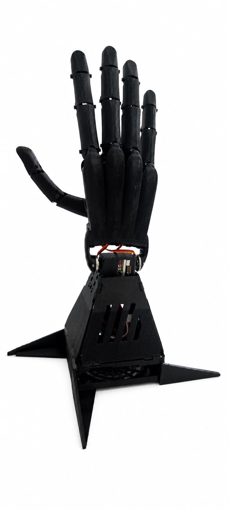

#+ATTR_HTML: :height 56%, :width 56% :align center
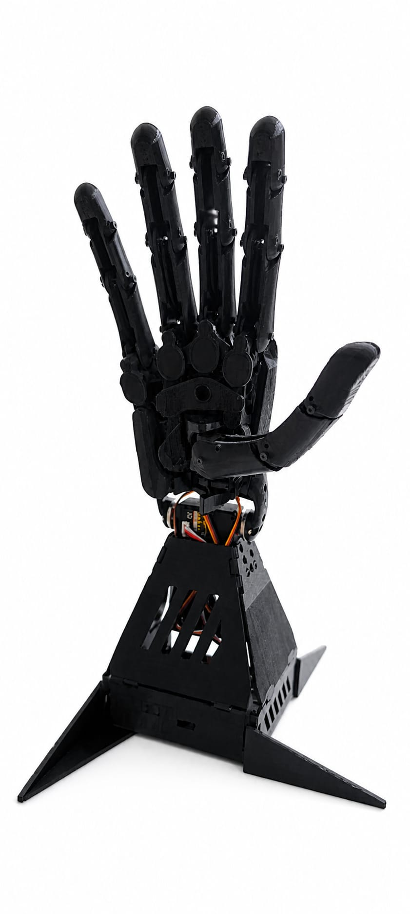

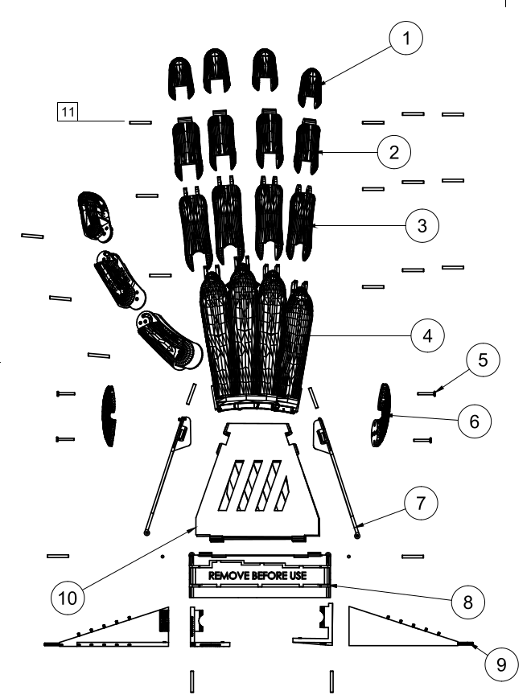
#+REVEAL_HTML: 

#+REVEAL_HTML: 

Projekt robot-nano-hand, the-robot-studio
#+REVEAL_HTML: 

* weitere mobile Roboter
#+REVEAL_HTML: 

#+ATTR_HTML: :height 70%, :width 70% :align center
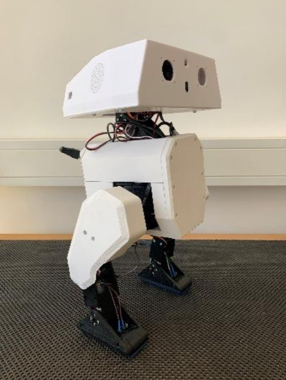

#+ATTR_HTML: :height 70%, :width 70% :align center
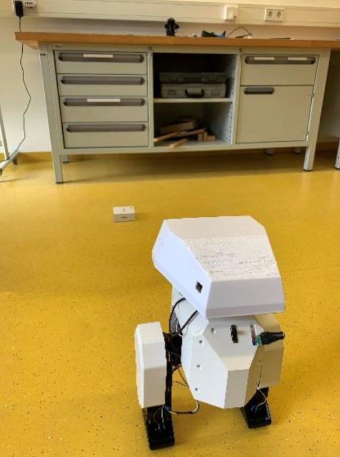

#+ATTR_HTML: :height 70%, :width 70% :align center
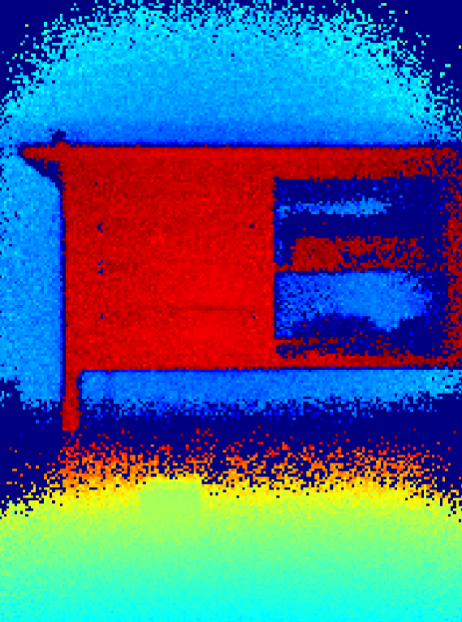
#+REVEAL_HTML: 

#+REVEAL_HTML: 

Abbildungen aus Bachelorarbeit "Konzeption und Implementierung eines Absturz- und Kollisionssicherungssystems für einen mobilen Laufroboter", Niklas Kohrmann

Projekt apirrone/Open-Duck-Mini
#+REVEAL_HTML: 

* Taktile Sensoren
#+ATTR_HTML: :height 100%, :width 100% :align center
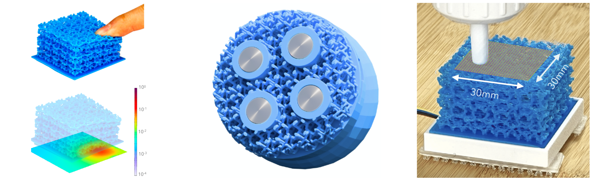

#+REVEAL_HTML: 

Projekt eFlesh: Highly customizable Magnetic Touch Sensing using Cut-Cell Microstructures

Venkatesh Pattabiraman and Zizhou Huang and Daniele Panozzo and Denis Zorin and Lerrel Pinto and Raunaq Bhirangi
#+REVEAL_HTML: 

* Vielen Dank für Ihre Aufmerksamkeit
{{{video(data-autoplay controls loop muted, 80%, ./assets/go2_standup.mp4)}}}

* Vielen Dank für Ihre Aufmerksamkeit!
:PROPERTIES:
:REVEAL_DATA_TRANSITION: zoom
:END:

#+REVEAL_HTML: 

#+REVEAL_HTML: 

#+ATTR_HTML: :style border-radius: 50%; width: 100%; max-width: 250px; object-fit: cover; aspect-ratio: 1/1; margin: 0 auto;
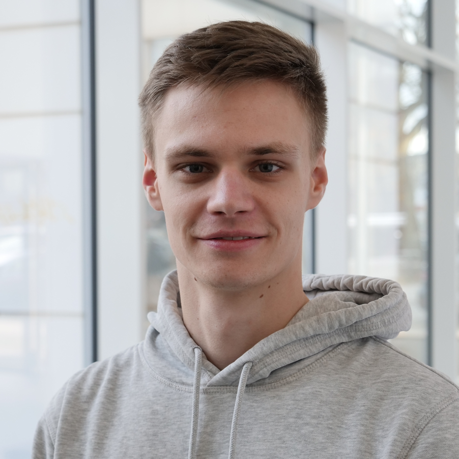
#+REVEAL_HTML: 

# --- RECHTE SPALTE: DATEN ---
#+REVEAL_HTML: 

#+REVEAL_HTML: <ul style="list-style-type: none; padding: 0; font-size: 80%;">
#+REVEAL_HTML: <li style="margin-bottom: 0.5em;">M.Eng. Eric Plaß</li>
#+REVEAL_HTML: <li style="margin-bottom: 0.5em;">E-Mail <a href="mailto:eric.elbing@htwk-leipzig.de" style="text-decoration: none;">eric.elbing@htwk-leipzig.de</a></li>
#+REVEAL_HTML: <li style="margin-bottom: 1.0em;">LinkedIn <a href="https://www.linkedin.com/in/eric-plass/"text-decoration: none;">/in/eric-plass</a></li>
#+REVEAL_HTML: <li style="margin-bottom: 0.5em;">HTWK Leipzig, Fakultät Ingenieurwissenschaften</li>
#+REVEAL_HTML: <li style="margin-bottom: 1.0em;"><a href="https://fing.htwk-leipzig.de/fakultaet/professuren/prof-martin-guertler" style="text-decoration: none;">Professur Produktions- und Logistiksysteme</a></li>
#+REVEAL_HTML: <li style="margin-bottom: 0.0em;">Nieper-Bau NI-107 / NI-108</li>
#+REVEAL_HTML: </ul>

#+REVEAL_HTML: 

#+ATTR_HTML: :height 30px :style margin: 0;

#+ATTR_HTML: :height 30px :style margin: 0;

#+ATTR_HTML: :height 30px :style margin: 0;

#+REVEAL_HTML: 

#+REVEAL_HTML: 

* Vielen Dank für Ihre Aufmerksamkeit!
:PROPERTIES:
:REVEAL_DATA_TRANSITION: zoom
:END:

#+REVEAL_HTML: 

#+REVEAL_HTML: 

#+ATTR_HTML: :style border-radius: 50%; width: 100%; max-width: 250px; object-fit: cover; aspect-ratio: 1/1; margin: 0 auto;
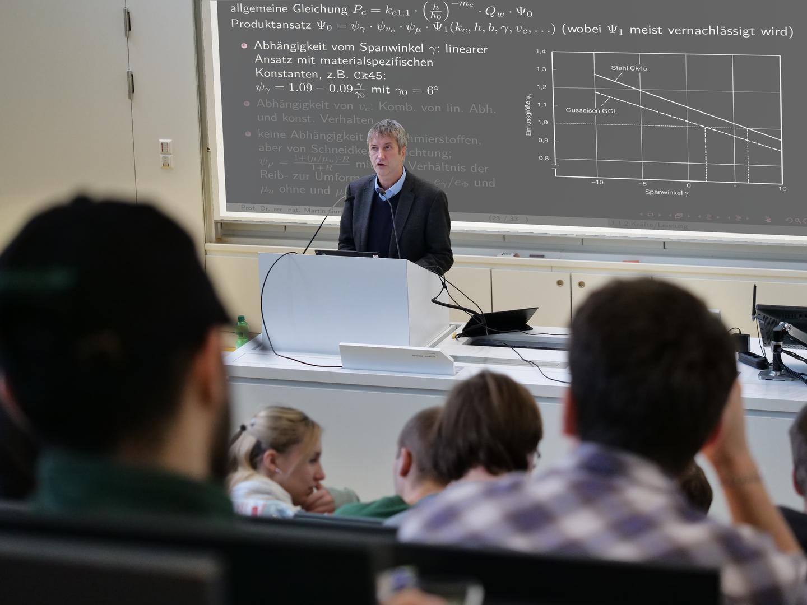
#+REVEAL_HTML: 

# --- RECHTE SPALTE: DATEN ---
#+REVEAL_HTML: 

#+REVEAL_HTML: <ul style="list-style-type: none; padding: 0; font-size: 80%;">
#+REVEAL_HTML: <li style="margin-bottom: 0.1em;"> Prof. Dr. rer. nat. Martin Gürtler </li>
#+REVEAL_HTML: <li style="margin-bottom: 1.1em;">E-Mail <a href="mailto:martin.guertler@htwk-leipzig.de" style="text-decoration: none;">martin.guertler@htwk-leipzig.de</a></li>
#+REVEAL_HTML: <li style="margin-bottom: 0.1em;">HTWK Leipzig, Fakultät Ingenieurwissenschaften</li>
#+REVEAL_HTML: <li style="margin-bottom: 1.0em;"><a href="https://fing.htwk-leipzig.de/fakultaet/professuren/prof-martin-guertler" style="text-decoration: none;">Professur Produktions- und Logistiksysteme</a></li>
#+REVEAL_HTML: </ul>

#+REVEAL_HTML: 

#+ATTR_HTML: :height 30px :style margin: 0;

#+ATTR_HTML: :height 30px :style margin: 0;

#+REVEAL_HTML: 

#+REVEAL_HTML: 

